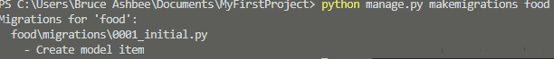
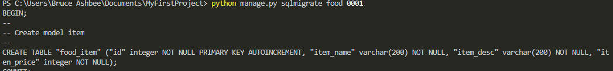
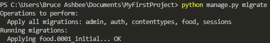
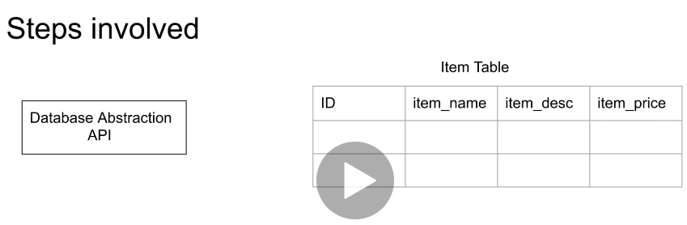
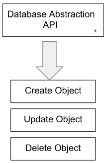

## `C:\Users\Bruce Ashbee\Documents\MyFirstProject\MyFirstProject\settings.py`
## app with database required

#first command
`Python manage.py makemigrations food`

#sec command
> Python manage.py sqlmigrate food 0001
### 0001 is看上面的圖 food\migrations\0001_initail.py

#CAUTION !! Django 自動幫我們弄了PRIMARY KEY id

`pyhon manage.py migrate`

## the migrate command which is actually going to create the table for us.

 #to create an object#use save() to save object to table